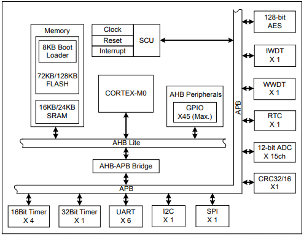

# [ES8P508](https://github.com/SoCXin/ES8P508)

#### [Vendor](https://github.com/SoCXin/Vendor) ：[Eastsoft](http://www.essemi.com/)
#### [Core](https://github.com/SoCXin/Cortex)：[Cortex M0](https://github.com/SoCXin/CM0)
#### [Level](https://github.com/SoCXin/Level) ：48 MHz * 0.95 DMIPS/MHz

## [ES8P508简介](https://github.com/SoCXin/ES8P508/wiki)

[ES8P508](https://github.com/SoCXin/ES8P508)拥有 6 路 UART 通信接口，128K+24K 存储方案，40mA电流IO

#### 关键特性

* UART x 6
* 宽电压 2.2～5.5V
* 128位 AES

### [资源收录](https://github.com/SoCXin)

* [文档](docs/)
* [资源](src/)

### [选型建议](https://github.com/SoCXin)

[ES8P508](https://github.com/SoCXin/ES8P508)拥有RTC,AES等多种实用外设，多串口性价比高，支持AliOS

###  [SoC.芯](http://www.SoC.Xin)
